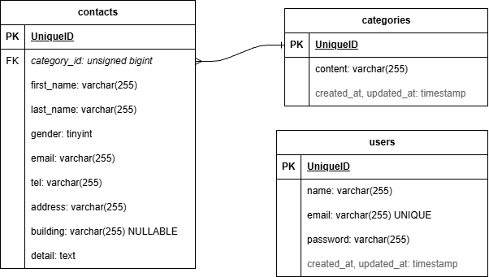

# お問い合わせフォーム

お問い合わせフォームの作成と管理を行うアプリケーションです。

## 環境構築

**Dockerビルド**

1. `git clone git@github.com:syosinsyananasi/contact-form-practice.git`
2. `docker-compose up -d --build`

**Laravel環境構築**

1. `docker-compose exec php bash`
2. `composer install`
3. `.env.example`ファイルから`.env`を作成し、環境変数を変更
4. `php artisan key:generate`
5. `php artisan migrate`
6. `php artisan db:seed`

## 使用技術（実行環境）

- PHP 8.1
- Laravel 8.75
- MySQL 8.0.26
- nginx 1.21.1

## ER図

## URL

### 開発環境

- お問い合わせ画面: http://localhost/
- ユーザー登録: http://localhost/register
- phpMyAdmin: http://localhost:8080/
